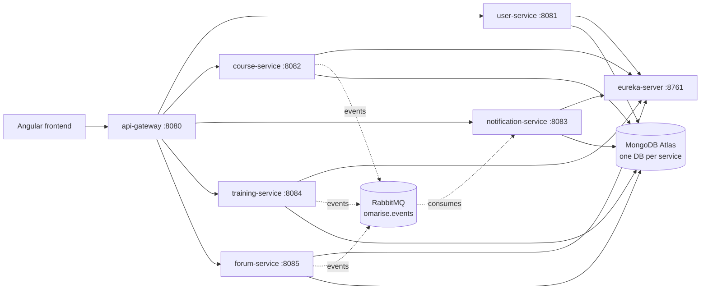

# OMARISE — Backend

E-learning platform backend built as a Spring Boot microservices architecture.
Students enroll in courses and trainings, watch videos and attend live
sessions, take quizzes and earn certificates, and discuss content in a
forum — while instructors and admins manage everything through the same
API.

**Stack:** Spring Boot 4.1.0 · Java 17 · Spring Cloud 2025.1.2 (Gateway +
Eureka) · MongoDB Atlas · RabbitMQ · Cloudinary · JWT auth

---

## Table of contents

- [Architecture](#architecture)
- [Services](#services)
- [Features by service](#features-by-service)
- [API Gateway routes](#api-gateway-routes)
- [Roles](#roles)
- [Prerequisites](#prerequisites)
- [Getting started](#getting-started)
- [Running the services](#running-the-services)
- [Verifying it's running](#verifying-its-running)
- [Security notes](#security-notes)
- [Known limitations / not implemented](#known-limitations--not-implemented)

---

## Architecture

All 7 units register with **Eureka** for service discovery and are reached
from the outside only through the **API Gateway** — clients never call a
business service directly.



Authentication is a single JWT, issued by `user-service` and stored in a
cookie, verified independently by every business service using **the same
shared secret** (`JWT_SECRET` — see [Getting started](#getting-started)).

Asynchronous notifications flow through a single RabbitMQ topic exchange
(`omarise.events`): `course-service` and `training-service` publish
enrollment-activation events, `forum-service` publishes new-post and
new-comment events, and `notification-service` consumes all four,
idempotently (deduplicated by event ID), and delivers them to the frontend
over Server-Sent Events (SSE).

## Services

| Service | Port | Role |
|---|---|---|
| `eureka-server` | 8761 | Service discovery/registry |
| `api-gateway` | 8080 | Single entry point, routes `/api/**` to each service |
| `user-service` | 8081 | Auth (JWT), user/admin management, Google sign-in |
| `course-service` | 8082 | Courses, chapters, videos, quizzes, enrollments, certificates |
| `notification-service` | 8083 | Notifications (RabbitMQ consumer + SSE) |
| `training-service` | 8084 | Trainings, live sessions, recordings, calendar |
| `forum-service` | 8085 | Discussion forum (posts, comments, bookmarks, upvotes) |

## Features by service

**user-service**
- Signup / login with JWT (httpOnly cookie), email verification by code
- Password reset flow (code + short-lived reset token)
- Google Sign-In
- Profile management, avatar upload (Cloudinary) or preset avatars
- Admin: list/create/update/disable users, assign roles

**course-service**
- CRUD for Course → Chapter → Video, and Quiz → Question (cascading)
- Student enrollment, per-video progress tracking
- Quiz attempts and scoring
- Certificate generation on course completion
- Cascading delete: removing a course also removes its chapters, videos,
  quizzes, questions, enrollments and progress records

**training-service**
- CRUD for Trainings (with `createdBy` / `instructorId` ownership)
- Live sessions, recordings, and a calendar view (upcoming/today sessions)
- Access to a session's meeting link / a recording's video is restricted to
  students with an **active** enrollment in that training
- Cascading delete for a training and everything under it

**forum-service**
- Posts scoped to either a course or a training, with comments
- Bookmarks and upvotes (idempotent: a duplicate action returns `409`, a
  repeat removal is a no-op)
- Paginated listing, sorted by recent or by popularity

**notification-service**
- Generic notification model, consumed from 4 RabbitMQ event types
  (enrollment activated on a course, enrollment activated on a training,
  new forum post on a training a formateur owns, new comment on your post)
- Idempotent consumption (unique index on event ID — a redelivered message
  is a no-op)
- Real-time delivery to the frontend via Server-Sent Events (SSE)

**api-gateway / eureka-server**
- Single routing layer in front of the 5 business services
- No business logic — routing and service discovery only

## API Gateway routes

All client traffic goes through `http://localhost:8080`:

| Path prefix | Routed to |
|---|---|
| `/api/auth/**`, `/api/users/**`, `/api/admin/**`, `/api/avatars/**` | user-service |
| `/api/courses/**`, `/api/chapters/**`, `/api/videos/**`, `/api/quizzes/**`, `/api/certificates/**`, `/api/enrollments/**` | course-service |
| `/api/notifications/**` | notification-service |
| `/api/trainings/**`, `/api/sessions/**`, `/api/recordings/**`, `/api/calendar/**`, `/api/training-enrollments/**` | training-service |
| `/api/forum/**` | forum-service |

## Roles

- **ADMIN** — user management, platform-wide administration
- **FORMATEUR** (instructor) — creates/manages their own courses and trainings
- **ETUDIANT** (student) — enrolls, learns, takes quizzes, participates in the forum

## Prerequisites

- **Java 17**
- **Maven** (each service ships its own wrapper, `mvnw` / `mvnw.cmd` — no
  separate Maven install required)
- A **MongoDB Atlas** cluster (or any reachable MongoDB instance) — one
  database per service
- A **RabbitMQ** instance (a local one via Docker is enough: `docker run -d
  --name rabbitmq -p 5672:5672 rabbitmq:3-management`)
- A **Cloudinary** account (free tier is enough) for image/video storage
- A **Gmail account with an App Password** for `user-service` to send
  verification/reset emails

## Getting started

1. **Clone this repository** — it's a single mono-folder containing all 7
   services as subfolders, so one clone is all you need:
   ```bash
   git clone https://github.com/Sa3id-Boubaker/e-learning-backend.git
   cd e-learning-backend
   ```

2. **Provide the required secrets.** No service will start without them —
   `application.yml` in each business service reads them from environment
   variables (`${VAR_NAME}`), nothing is hardcoded. See
   [`ENV_SETUP.md`](./ENV_SETUP.md) for the complete list of variables and
   which service needs which. Two ways to provide them:
   - **System-wide (simplest):** set the variables as OS environment
     variables (or `SPRING_PROFILES_ACTIVE=local`, see below), then restart
     your IDE so it picks them up.
   - **Per-service local file:** create a `src/main/resources/application-local.yml`
     in each service with the real values (this filename is already
     git-ignored, so it's never committed) and activate it with
     `SPRING_PROFILES_ACTIVE=local`.

3. You're ready to run the services — see below.

## Running the services

Start them in this order (each one registers with Eureka on boot, so a
short delay between steps is normal):

1. `eureka-server`
2. `api-gateway`
3. The 5 business services, in any order: `user-service`, `course-service`,
   `notification-service`, `training-service`, `forum-service`

From each service's folder:
```bash
./mvnw spring-boot:run        # macOS/Linux
mvnw.cmd spring-boot:run      # Windows
```
Or simply run the `*Application.java` main class from your IDE (IntelliJ,
etc.) — make sure the run configuration has the environment variables /
active profile from step 2 above.

## Verifying it's running

- **Eureka dashboard:** `http://localhost:8761` — all 6 other services
  should appear as `UP` once started.
- **Health check per service** (through the gateway or directly):
  `health,info` actuator endpoints are exposed on `course-service`,
  `training-service`, `forum-service`, `api-gateway`.
- **A simple end-to-end check:** `POST http://localhost:8080/api/auth/login`
  with a valid account should return a JWT cookie, and a subsequent
  `GET http://localhost:8080/api/courses` should succeed with it.

## Security notes

This is a school/demo project — a few things would need addressing before
any real production deployment:
- No CORS configuration exists on any service; it currently works only
  because the Angular dev server proxies `/api/**` to the gateway on the
  same origin. A real deployment (frontend and backend on different
  origins) would need explicit CORS rules.
- Secrets are read from environment variables / a git-ignored local
  profile, but nothing here does secret rotation, vaulting, or encryption
  at rest — fine for a demo, not for production.

## Known limitations / not implemented

- No self-service online payment (course/training activation is manual,
  admin-driven)
- No course ratings/reviews
- No automated reminder before a live session
- No certificate for trainings (only courses currently generate one)
- Video progress is binary (watched / not watched), no resume position
- Forum is scoped to course/training level, not per-lesson
- No private messaging between students and instructors
